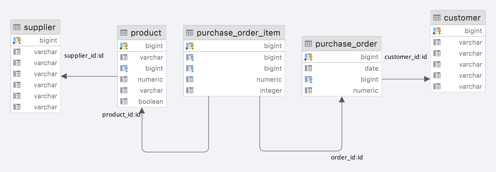

# Alternatives to the Criteria API
The Criteria API quickly becomes unmanageable and complex even for simple queries. This project presents 3 alternatives to the Criteria API that are still based on JPA.

## About

This project contains 3 alternative methods to access a database via the JPA API.

- jOOQ
- JPAStreamer
- QueryDSL

This project also shows how Liquibase, Docker, and jOOQ can be combined to start a database while building, update the schema, and then generate the necessary classes for jOOQ from that. In addition, the generators for JPAStreamer and QueryDSL, which are both based on annotation processing, are also executed.

## Prerequisites

To run the examples you need the following tools installed:

- Maven
- Java 16
- Docker


## Running the example

To run the example execute the following commands in the project root.
1. Build the artifact. This command starts a container containing a PostgreSQL database. This database is used by the jooq codegenerator. __Notice:__ _The database port is randomized with each invocation, and you need to remove the container before each invocation_
```shell
./mvnw clean package
```
2. Run the example application. __Notice:__ _The application will reuse the container used during the codegeneration. The port is set automagically._
```shell
java -jar target/criteria-api-alternatives-1.0-SNAPSHOT.jar 
``` 
3. The output should be similar to the following 
```
11:09:29.402 [main] INFO  d.s.b.c.Application - -------------- Criteria API --------------
11:09:29.535 [main] DEBUG org.hibernate.SQL - select customer0_.id as id1_0_, customer0_.city as city2_0_, customer0_.country as country3_0_, customer0_.first_name as first_na4_0_, customer0_.last_name as last_nam5_0_, customer0_.phone as phone6_0_ from Customer customer0_ where customer0_.last_name=?
11:09:29.558 [main] INFO  d.s.b.c.Application - Found customer via criteria API: Customer{id=1, firstName='Patrick', lastName='Stuart', city='Mirfield', country='England', phone='555-12345'}
11:09:29.570 [main] DEBUG org.hibernate.SQL - select purchaseor0_.id as id1_1_, purchaseor0_.customer_id as customer4_1_, purchaseor0_.order_date as order_da2_1_, purchaseor0_.total_amount as total_am3_1_ from purchase_order purchaseor0_ inner join Customer customer1_ on purchaseor0_.customer_id=customer1_.id where customer1_.last_name=?
11:09:29.581 [main] INFO  d.s.b.c.Application - Found oder via criteria API: PurchaseOrder{id=1, orderDate=2021-10-31, customer=Customer{id=1, firstName='Patrick', lastName='Stuart', city='Mirfield', country='England', phone='555-12345'}, totalAmount=1701.86}
11:09:29.585 [main] INFO  d.s.b.c.Application - --------------- JOOQ ---------------
11:09:30.251 [main] DEBUG org.hibernate.SQL - select "public"."customer"."id", "public"."customer"."first_name", "public"."customer"."last_name", "public"."customer"."city", "public"."customer"."country", "public"."customer"."phone" from "public"."customer" where "public"."customer"."last_name" = ?
11:09:30.256 [main] INFO  d.s.b.c.Application - Found customer via jooq: Customer{id=1, firstName='Patrick', lastName='Stuart', city='Mirfield', country='England', phone='555-12345'}
11:09:30.265 [main] DEBUG org.hibernate.SQL - select "public"."purchase_order"."id", "public"."purchase_order"."order_date", "public"."purchase_order"."customer_id", "public"."purchase_order"."total_amount", "public"."customer"."id", "public"."customer"."first_name", "public"."customer"."last_name", "public"."customer"."city", "public"."customer"."country", "public"."customer"."phone" from "public"."purchase_order" join "public"."customer" on "public"."purchase_order"."customer_id" = "public"."customer"."id" where "public"."customer"."last_name" = ?
11:09:30.269 [main] INFO  d.s.b.c.Application - Found oder via jooq: PurchaseOrder{id=1, orderDate=2021-10-31, customer=Customer{id=1, firstName='Patrick', lastName='Stuart', city='Mirfield', country='England', phone='555-12345'}, totalAmount=1701.86}
11:09:30.269 [main] INFO  d.s.b.c.Application - --------------- JPA Streamer ---------------
11:09:30.430 [main] DEBUG org.hibernate.SQL - select customer0_.id as id1_0_, customer0_.city as city2_0_, customer0_.country as country3_0_, customer0_.first_name as first_na4_0_, customer0_.last_name as last_nam5_0_, customer0_.phone as phone6_0_ from Customer customer0_ where customer0_.last_name=?
11:09:30.460 [main] INFO  d.s.b.c.Application - Found customer via jpa streamer: Customer{id=1, firstName='Patrick', lastName='Stuart', city='Mirfield', country='England', phone='555-12345'}
11:09:30.463 [main] DEBUG org.hibernate.SQL - select "public"."purchase_order"."id", "public"."purchase_order"."order_date", "public"."purchase_order"."customer_id", "public"."purchase_order"."total_amount", "public"."customer"."id", "public"."customer"."first_name", "public"."customer"."last_name", "public"."customer"."city", "public"."customer"."country", "public"."customer"."phone" from "public"."purchase_order" join "public"."customer" on "public"."purchase_order"."customer_id" = "public"."customer"."id" where "public"."customer"."last_name" = ?
11:09:30.610 [main] INFO  d.s.b.c.Application - Found oder via jpa streamer: PurchaseOrder{id=1, orderDate=2021-10-31, customer=Customer{id=1, firstName='Patrick', lastName='Stuart', city='Mirfield', country='England', phone='555-12345'}, totalAmount=1701.86}
11:09:30.610 [main] INFO  d.s.b.c.Application - --------------- QueryDSL ---------------
11:09:30.705 [main] DEBUG org.hibernate.SQL - select customer0_.id as id1_0_, customer0_.city as city2_0_, customer0_.country as country3_0_, customer0_.first_name as first_na4_0_, customer0_.last_name as last_nam5_0_, customer0_.phone as phone6_0_ from Customer customer0_ where customer0_.last_name=?
11:09:30.709 [main] INFO  d.s.b.c.Application - Found customer via QueryDSL: Customer{id=1, firstName='Patrick', lastName='Stuart', city='Mirfield', country='England', phone='555-12345'}
11:09:30.711 [main] DEBUG org.hibernate.SQL - select "public"."purchase_order"."id", "public"."purchase_order"."order_date", "public"."purchase_order"."customer_id", "public"."purchase_order"."total_amount", "public"."customer"."id", "public"."customer"."first_name", "public"."customer"."last_name", "public"."customer"."city", "public"."customer"."country", "public"."customer"."phone" from "public"."purchase_order" join "public"."customer" on "public"."purchase_order"."customer_id" = "public"."customer"."id" where "public"."customer"."last_name" = ?
11:09:30.714 [main] INFO  d.s.b.c.Application - Found oder via QueryDSL: PurchaseOrder{id=1, orderDate=2021-10-31, customer=Customer{id=1, firstName='Patrick', lastName='Stuart', city='Mirfield', country='England', phone='555-12345'}, totalAmount=1701.86}

```

## Database

The following database schema was used. 

